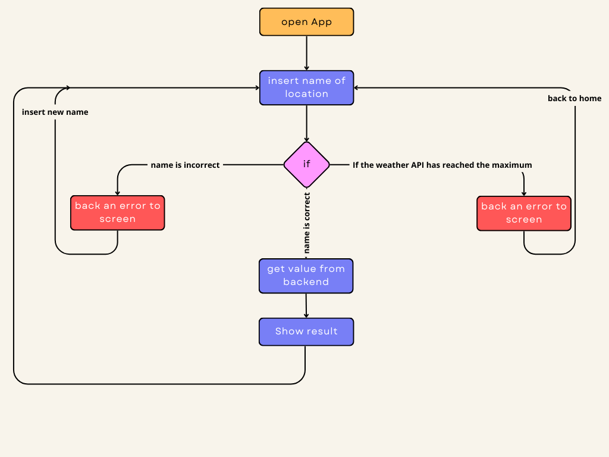

# Weather App

### Introduction
Hi, this is the source code of my web app dedicated to weather should you like it I invite you to follow me for future updates!
### Development tools
- <a href="https://create-react-app.dev/docs/getting-started"> React </a>
- <a href="https://vercel.com/"> Hosting </a>
- <a href="https://www.meteosource.com/"> API for weather </a>
- <a href="https://react-leaflet.js.org/"> Maps library </a>
- <a href="https://tailwindcss.com/docs/guides/create-react-app"> Style </a>
- <a href="https://reactrouter.com/en/main"> Route </a>
- <a href="https://redux-toolkit.js.org/"> Manager state </a>
- <a href="https://www.npmjs.com/package/dotenv#-install"> environment variables </a>
### Description
Hi all, the application is entirely developed in React with several attached libraries and APIs. (Links are present “Development tools”)
The workflow is as shown in the picture:

### App instruction
how to function the app?
it's easy because you insert name of location (ex. name of a city) after send request and wait the response for then get the value and show the result.

### Extra info
- the input are sanitized and accept only string.
- the endpoint accept only max 400 call at day.
- the files that not are presents in a folder but are present as file is because is present only this type of file 